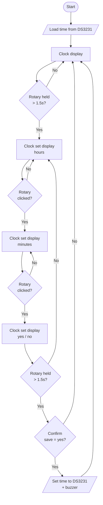

# Digital-Clock-with-Arduino-Nano

A digital clock with ds3231 that display using max7219 and can set the clock with rotary encoder ky 040

## How To Use
- Hold 1.5s -> switch to setclock display/default display
- rotate -> change the number
- click -> change the mode (hour, minute, save)

## Flowchart

